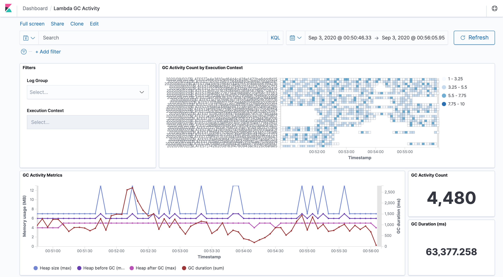
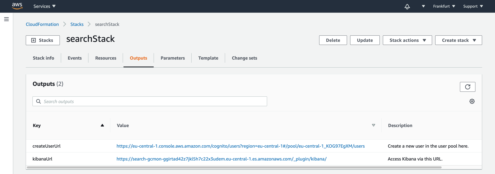
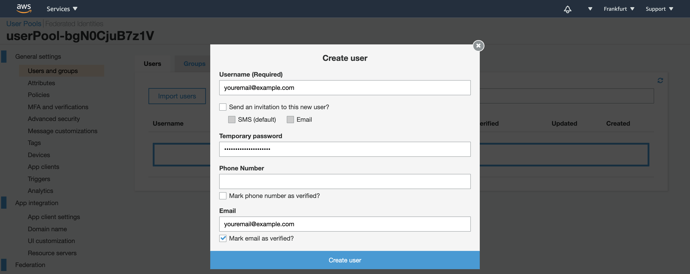
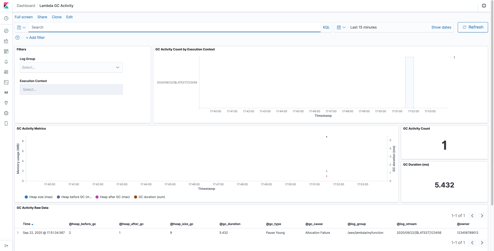
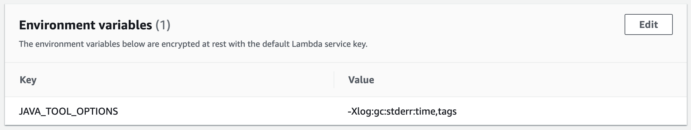
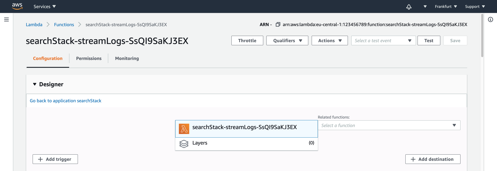
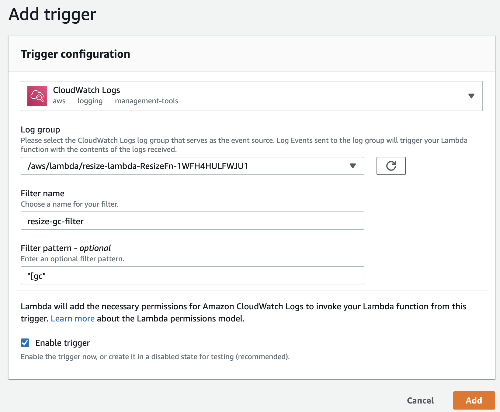

# Monitoring the Java Virtual Machine Garbage Collection on AWS Lambda

This is the implementation for the solution architecture introduced in the blog post about [monitoring the Java Virtual Machine garbage collection on AWS Lambda](https://aws.amazon.com/blogs/architecture/field-notes-monitoring-the-java-virtual-machine-garbage-collection-on-aws-lambda/).

When you want to optimize your Java application on [AWS Lambda](https://aws.amazon.com/lambda/) for performance and cost the general steps are: Build, measure, then optimize! To accomplish this, you need a solid monitoring mechanism. [Amazon CloudWatch](https://docs.aws.amazon.com/lambda/latest/dg/monitoring-cloudwatchlogs.html) and [AWS X-Ray](https://docs.aws.amazon.com/lambda/latest/dg/services-xray.html) are well suited for this task since they already provide lots of data about your AWS Lambda function. This includes overall memory consumption, initialization time, and duration of your invocations. To examine the Java Virtual Machine (JVM) memory you require garbage collection logs from your functions. Instances of an AWS Lambda function have a short lifecycle compared to a long-running Java application server. It can be challenging to process the logs from tens or hundreds of these instances.

With this solution you emit and collect data to monitor the JVM garbage collector activity. Having this data, you can visualize out-of-memory situations of your applications in a Kibana dashboard like in the following screenshot. You gain actionable insights into your application’s memory consumption on AWS Lambda for troubleshooting and optimization.



## Get Started

To start, launch the solution architecture described above as a prepackaged application from the AWS Serverless Application Repository. It contains all resources ready to visualize the garbage collection logs for your Java 11 AWS Lambda functions in a Kbana dashboard. The search cluster consists of a single `t3.small.elasticsearch` instance with 10GB of EBS storage. It is protected with Amazon Cognito User Pools so you only need to add your user(s). The application template prefixes the search domain and the Amazon Cognito Hosted UI with a string that you can define with the `applicationPrefix` template parameter.

### Option A: Spin up the application from the AWS Serverless Application Repository:

[](https://serverlessrepo.aws.amazon.com/#/applications/arn:aws:serverlessrepo:us-east-1:387304072572:applications~monitor-java-gc-on-aws-lambda)

### Option B: Deploy the template from code

You deploy the template with [AWS Serverless Application Model](https://docs.aws.amazon.com/serverless-application-model/latest/developerguide/serverless-sam-cli-install.html) (AWS SAM). Additionally, you will need the [AWS CLI](https://docs.aws.amazon.com/cli/latest/userguide/cli-chap-install.html) and the [CDK](https://docs.aws.amazon.com/cdk/latest/guide/getting_started.html).

1. The CDK template is written in TypeScript. TypeScript sources must be compiled to JavaScript initially and after each modification. Open a new terminal and keep this terminal open in the background if you like to change the source files. Change the directory to the one where `cdk.json` is and execute:

    ```bash
    npm install
    npm run watch
    ```

    Read the [CDK developer guide](https://docs.aws.amazon.com/cdk/latest/guide/home.html) for more information.

2. Synthesize the CDK template to an AWS CloudFormation template:

    ```bash
    cdk synth --version-reporting false > synth.yaml
    ```

3. Optionally run the tests:

    ```bash
    ./run-unit-tests.sh
    ```

4. Build the application. The `sam build` builds all AWS Lambda functions with `npm`:

    ```bash
    sam build -t synth.yaml
    ```

5. Package and deploy the template. `sam deploy` [transforms](https://docs.aws.amazon.com/serverless-application-model/latest/developerguide/serverless-deploying.html) the template to AWS CloudFormation code and uploads this template and the AWS Lambda function code as a package to S3.

    ```bash
    sam deploy --guided
    ```

### Access the Example Dashboard

1. As soon as the application is deployed completely the outputs of the [AWS CloudFormation stack](https://docs.aws.amazon.com/AWSCloudFormation/latest/UserGuide/stacks.html) provides the links for the next steps. You will find two URLs in the AWS CloudFormation console called `createUserUrl` and `kibanaUrl`.


2. Use the `createUserUrl` link from the outputs, or navigate to the [Amazon Cognito user pool](https://docs.aws.amazon.com/cognito/latest/developerguide/cognito-user-identity-pools.html) in the console to create a new user in the pool.

    - Enter an email address as username and email. Enter a temporary password of your choice with at least 8 characters.
    - Leave the phone number empty and uncheck the checkbox to mark the phone number as verified.
    - If necessary, you can check the checkboxes to send an invitation to the new user or to make the user verify the email address.
    - Choose **Create user**.
    

3. Access the Kibana dashboard with the `kibanaUrl` link from the AWS CloudFormation stack outputs, or navigate to the Kibana link displayed in the Amazon Elasticsearch Service console.

    - In Kibana, choose the Dashboard icon in the left menu bar
    - Open the *Lambda GC Activity* dashboard.

4. You can test that new events appear by using the Kibana Developer Console:

    ```json
    POST gc-logs-2020.09.03/_doc
    {
    "@timestamp": "2020-09-03T15:12:34.567+0000",
    "@gc_type": "Pause Young",
    "@gc_cause": "Allocation Failure",
    "@heap_before_gc": "2",
    "@heap_after_gc": "1",
    "@heap_size_gc": "9",
    "@gc_duration": "5.432",
    "@owner": "123456789012",
    "@log_group": "/aws/lambda/myfunction",
    "@log_stream": "2020/09/03/[$LATEST]123456"
    }
    ```

5. When you go to the *Lambda GC Activity* dashboard you can see the new event. You must select the right timeframe with the **Show dates** link.

    

The dashboard consists of six tiles:

- In the **Filters** you can optionally select the log group and filter for a specific AWS Lambda function execution context by the name of its log stream.
- In the **GC Activity Count by Execution Context** you see a heatmap of all filtered execution contexts by garbage collection activity count.
- The **GC Activity Metrics** display a graph for the metrics for all filtered execution contexts.
- The **GC Activity Count** shows the amount of garbage collection activities that are currently displayed.
- The **GC Duration** show the sum of the duration of all displayed garbage collection activities.
- The **GC Activity Raw Data** at the bottom displays the raw items as ingested into the search cluster for a further drill down.

### Configure your AWS Lambda function for garbage collection logging

1. The application that you want to monitor needs to log garbage collection activities. Currently the solution supports logs from **Java 11**. Add the following environment variable to your AWS Lambda function to activate the logging.

    ```bash
    JAVA_TOOL_OPTIONS=-Xlog:gc:stderr:time,tags
    ```

    The **environment variables** must reflect this parameter like the following screenshot:

    

2. Go to the `streamLogs` function in the AWS Lambda console that has been created by the stack, and subscribe it to the log group of the function you want to monitor.

    

3. Select **Add Trigger**.

4. Select **CloudWatch Logs** as **Trigger Configuration**.

5. Input a **Filter name** of your choice.

6. Input `"[gc"` (including quotes) as the **Filter pattern** to match all garbage collection log entries.

7. Select the **Log Group** of the function you want to monitor. The following screenshot subscribes to the logs of the application’s function `resize-lambda-ResizeFn-[...]`.

    

8. Select **Add**.

9. Execute the AWS Lambda function you want to monitor.

10. Refresh the dashboard in Amazon Elasticsearch Service and see the datapoint added manually before appearing in the graph.

### Cost estimation and clean up

If you do not need the garbage collection monitoring anymore, delete the subscription filter from the log group of your AWS Lambda function(s). Also, delete the stack of the solution above in the AWS CloudFormation console to clean up resources.

1. Sign in to the AWS CloudFormation console and choose your stack.
2. Choose the `streamLogs` AWS Lambda function so the function is displayed in the AWS Lambda console.
3. Delete all triggers in the **Designer** panel.
4. Go back to the AWS CloudFormation console and your stack.
5. Choose **Delete** to delete all resources, including the search cluster and the Amazon Cognito user pool.

## FAQs

### Q: In which region can I deploy the sample application?

The Launch Stack button above opens the AWS Serverless Application Repository in the US East 1 (Northern Virginia) region. You may switch to other regions from there before deployment.

### Q: How much do resources in this template cost?

Standard AWS charges apply to the resources you deploy with this template.

Cost for the processing and transformation of your function's Amazon CloudWatch Logs incurs when your function is called. This cost depends on your application and how often GC activities are triggered.

Amazon Elasticsearch Service provides customers in the [AWS Free Tier](https://aws.amazon.com/free/) free usage of up to 750 hours per month of the configuration in this template, i.e. a single-AZ `t3.small.elasticsearch` instance and 10GB of EBS storage for up to one year from the date the account was created. If you exceed the free tier limits, you will be charged the Amazon Elasticsearch Service rates for the additional resources you use. Read an [estimate of the monthly cost of the search cluster](https://calculator.aws/#/estimate?id=2eb5bf80f1aa4177a0021101488874078a2d847e).

The Amazon Cognito User Pool feature has a free tier of 50,000 monthly active users for users who sign in directly to Cognito User Pools. The free tier does not automatically expire at the end of your 12 month AWS Free Tier term, and it is available to both existing and new AWS customers indefinitely.

See offer terms of [Amazon Cognito](https://aws.amazon.com/cognito/pricing/), [Amazon Elasticsearch Service](https://aws.amazon.com/elasticsearch-service/pricing/), [AWS Lambda](https://aws.amazon.com/lambda/pricing/), and [Amazon CloudWatch](https://aws.amazon.com/cloudwatch/pricing/) for more details.

### Q: How can I contribute?

See the [Contributing Guidelines](CONTRIBUTING.md) for details.

## Security

See [CONTRIBUTING](CONTRIBUTING.md) for more information.

## License

This library is licensed under the MIT-0 License. See the [LICENSE](LICENSE) file.
